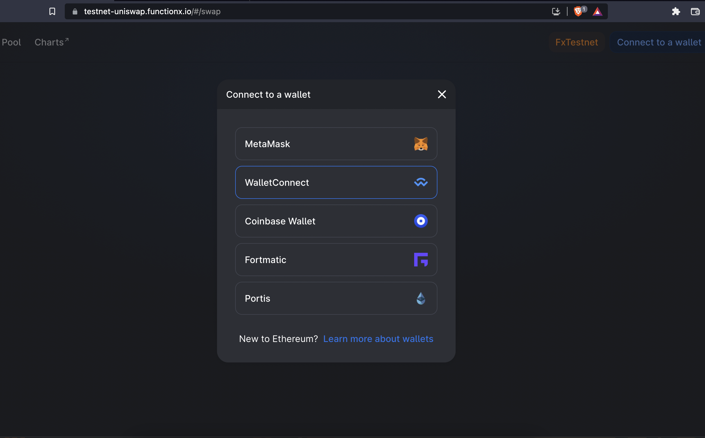
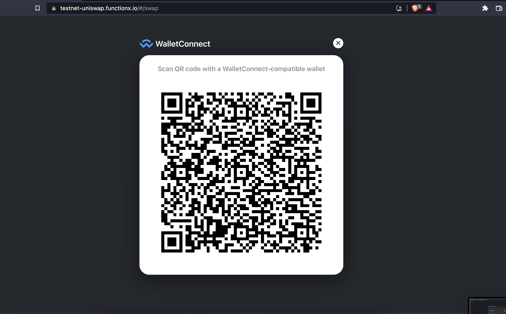
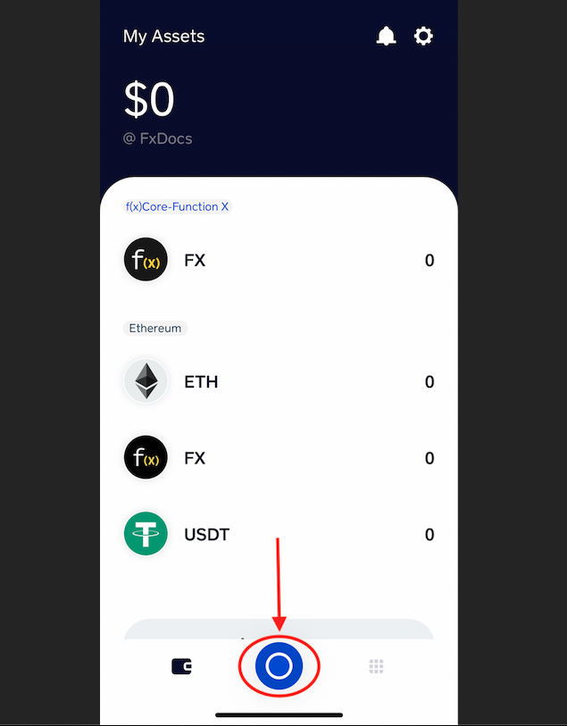
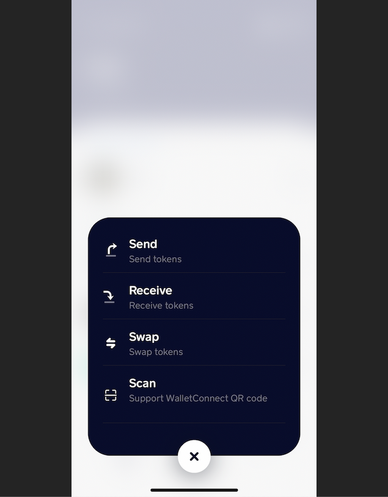
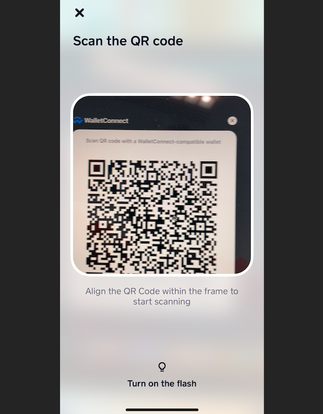
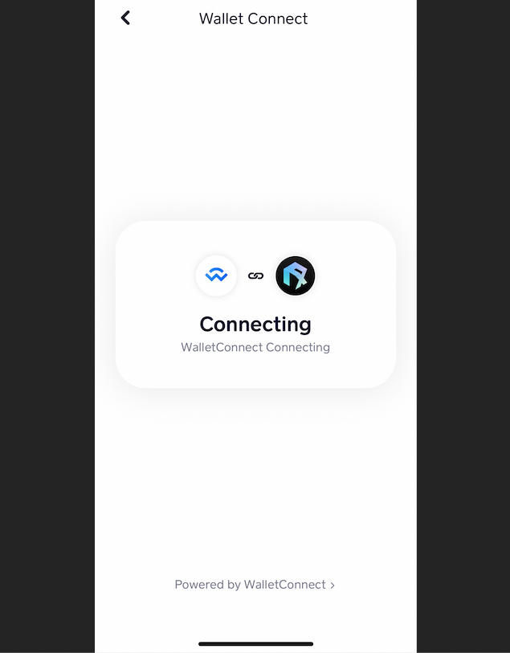
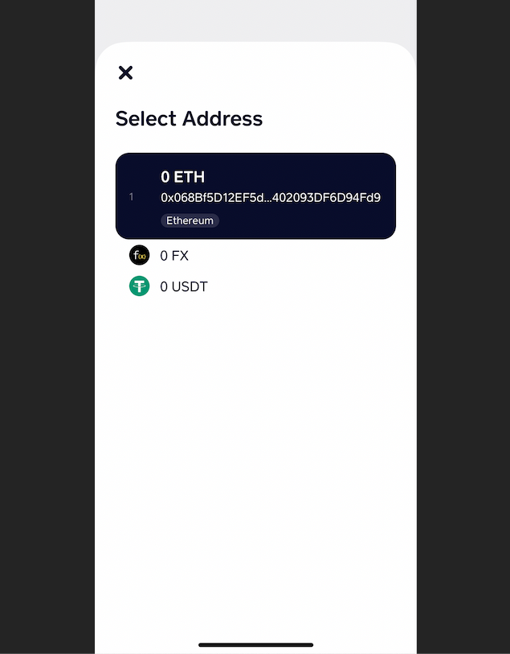
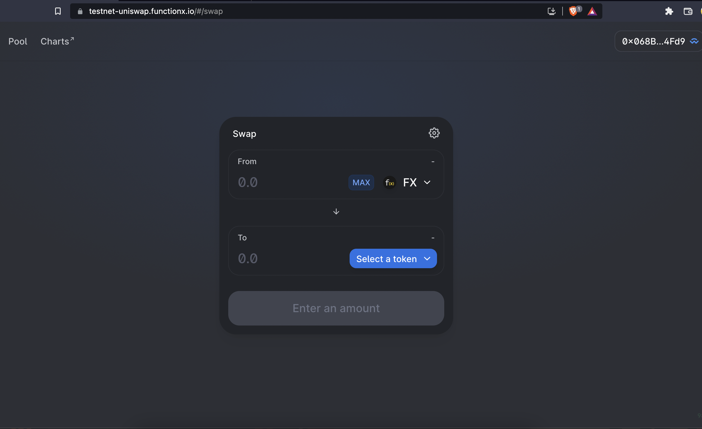
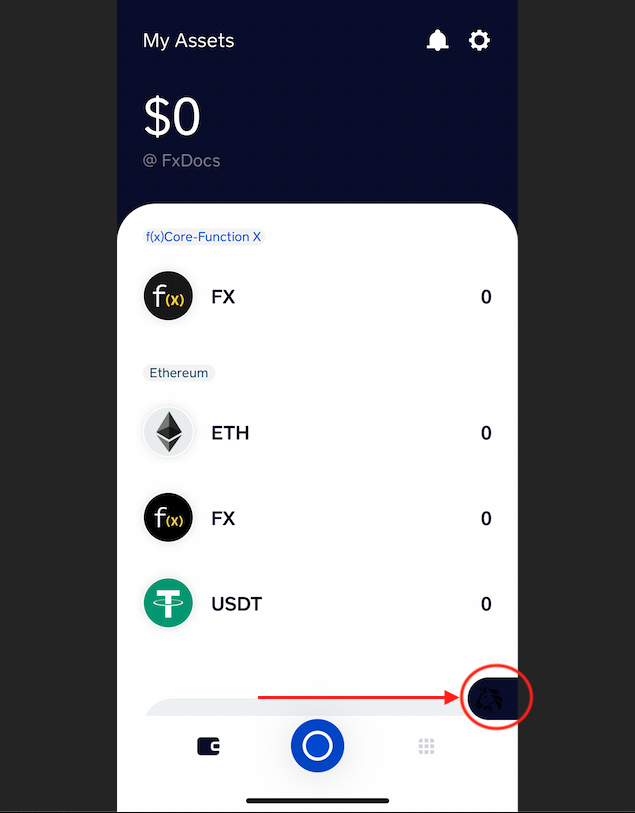
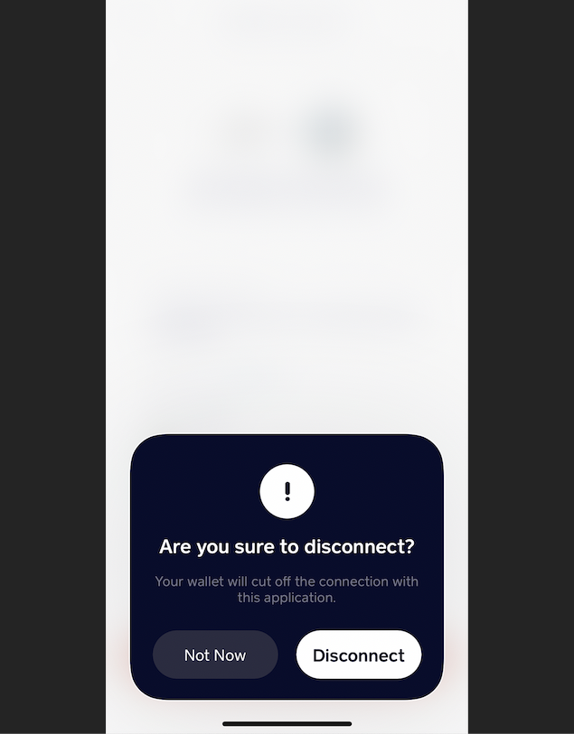

# Connect using f(x)Wallet (Wallet Connect)

## Connecting through the UI

### Connect f(x)Wallet account to Dapp

When you create an account on the f(x)Wallet application, it automatically generates an Ethereum address. This address can be used to interact with Dapps via Wallet Connect. In this tutorial iOS is used, the process is similar on Andriod.


Only connect to websites that you trust. Always check that the URL is correct, and bookmark Dapps that you regularly visit/use.


1. Click on 'Connect Wallet' or 'Connect to a wallet'. Other Dapps will have similar buttons for the user to connect their wallet to start using the application.
2. Select 'WalletConnect'
3. A QR code will appear
4. Open f(x)Wallet, and click on the blue button at the bottom.
5. Select 'Scan'
6. Scan the QR code
7. The wallet will show it is connecting for a brief moment
8. Select the address you want to connect to the Dapp
9. Click on 'Authorize'
10. Now, you will see your address of the account at the top right hand corner instead of 'Connect to a wallet'






Read from left to right.


 

 

 



### Disconnect f(x)Wallet account from Dapp

WalletConnect only allows you to connect to one Dapp at a time. You will have to disconnect from the previous Dapp before connecting to another Dapp. It is good practice to disconnect your account from the Dapp when you are done using it.

1. You will see a tab appear on your f(x)wallet home screen, click on it and it will open up the page for you to disconnect
2. Click on 'Disconnect'
3. It will prompt you once more, click on 'Disconnect' again

  

Your Dapp should now not show your address being connected anymore.

## For Developers

### Dependencies

* fxwallet version (minimum): v2.0
* fx-js-sdk: [https://www.npmjs.com/package/fx-js-sdk](https://www.npmjs.com/package/fx-js-sdk)

### WalletConnectId

* 39778

### CHAIN\_ID

* fxevm

### Get Accounts


```javascript
export function getAccountRequest(chainIds) {
  return {
    id: payloadId(),
    jsonrpc: '2.0',
    method: 'functionx_wc_accounts_v1',
    params: chainIds,
  };
}
```


Example


```javascript
const request = getAccountRequest([CHAIN_ID,CHAIN_ID]);
connector.sendCustomRequest(request)
  .then((accounts) => {
    setAccounts(accounts);
    console.log(accounts.length == 1);
  }).catch((error) => {
    console.error(error);
  });
```


Result

\[name, algo, publicKey, addressByte, bech32Address]

### Sign Transactions (amino)

Sign transaction using FunctionX Mobile Wallet via Wallet Connect

* signer: bech32Address

Example:


```javascript
import {
  makeSignDoc as makeAminoSignDoc,
  serializeSignDoc
} from "@cosmjs/amino"
import { fromUtf8 } from "@cosmjs/encoding"

const signDoc = makeAminoSignDoc(messages, fee, chainId, memo, accountNumber, sequence)
const signBytes = serializeSignDoc(signDoc)
const signData = fromUtf8(signBytes)
     
connector.sendCustomRequest({
    id: payloadId(),
    jsonrpc: '2.0',
    method: 'functionx_wc_sign_tx_v1',
    params: [chainId, signer, signData],
  })
  .then((response) => {
    const signed = _.get(response, '0.signed');
    const signature = _.get(response, '0.signature');
    return broadcastTx(signed, signature);
  }).then((result) => {
    const code = _.get(result, 'code');
    if (code === 0) {
      const txHash = _.get(result, 'txhash');
      console.log(txHash);
    } else {
      const rawLog = _.get(result, 'raw_log');
      console.error(rawLog);
    }
  })
```

